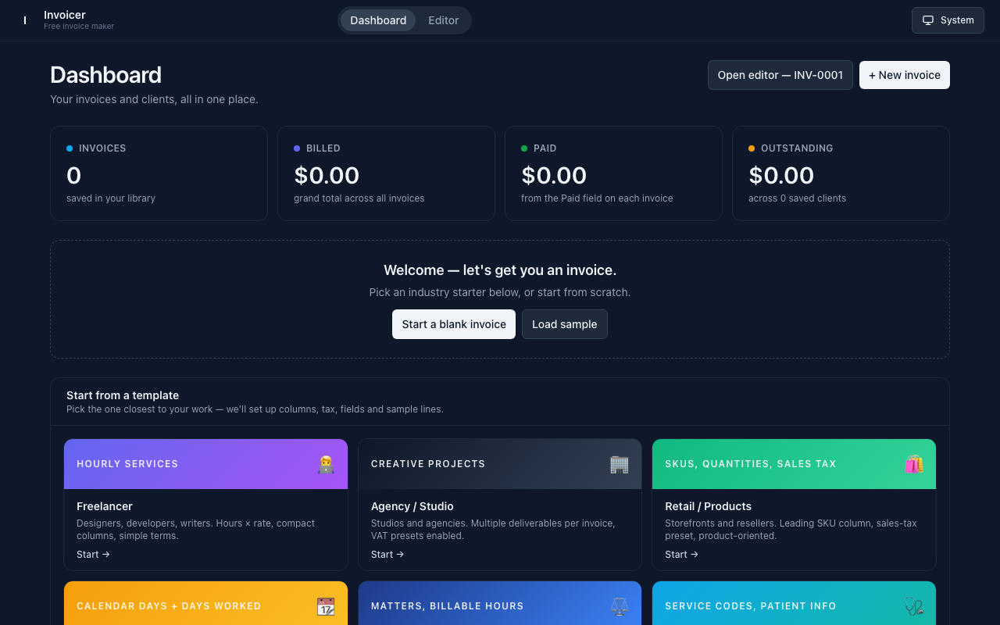

# Invoicer — Free, In-Browser Invoice Maker

Build, customise, save and export professional invoices entirely in your browser.
**No signup. No cloud. No subscription.** Everything stays on your device.

**[invoicer.kamalahmed.me](https://invoicer.kamalahmed.me/)**

---

## Why this exists

Most "free" invoice tools ask you to register, store your data on their servers,
and lock half the templates behind a paywall. This one doesn't:

- Open the page, build an invoice, download a PDF — that's it.
- Your data lives in your browser's local storage. Nothing is sent anywhere.
- Source is MIT-licensed. Use it, fork it, host it yourself.

---

## Features

### Editor & preview
- **Click-to-edit** — click any zone in the live preview and the matching builder section scrolls into view.
- **Independent-scroll columns** on desktop — the preview stays put while you scroll the form.
- **Mobile-friendly** with Edit/Preview tabs and an installable PWA.

### Templates
- **Ten visual templates** — Classic, Modern, Minimal, Corporate, Creative, Elegant, Dark, Gradient, Bold, Playful.
- **Per-invoice accent colour** with 10 preset swatches and a colour picker.
- **Font choice** — Inter (sans), Playfair Display (serif), or JetBrains Mono.
- **Logo upload** — drop a PNG/JPG/SVG.

### Industries (one-click setup)
Six starter presets: Freelancer, Agency / Studio, Retail / Products, Contractor (day rate), Legal / Consulting, Medical / Healthcare.

### Line items
- **Quantity × Rate** or **Days Worked × Rate** modes.
- **Per-line override** — type a Total directly; Rate auto-derives while keeping the override fixed.
- **Editable column labels** with sensible defaults.
- **Hide / show columns** — Serial, Calendar Days, Qty, Rate, Tax, Discount.
- **Optional Serial / Ref column** for SKUs, dates, or order numbers.
- **Choose the wide column** — Description (default) or Serial / Ref.
- **Move / duplicate / remove** rows.

### Tax
Built-in presets for VAT (UK 20%, EU 21%, Germany 19%, France 20%, UAE 5%, KSA 15%), GST (India 5/12/18/28%, Australia 10%, NZ 15%, Singapore 9%, Canada 5%), Ontario HST 13%, US Sales Tax 7%, Pakistan 15%, plus Custom. On-subtotal or per-line application, inclusive/exclusive pricing toggle, split tax for India GST (CGST + SGST).

### Custom fields
Add any number of `Label → Value` rows that appear next to Date / Invoice #. Useful for PO #, Project code, Patient ID, etc.

### Multi-currency
10 currencies built-in (USD, EUR, GBP, AED, SAR, INR, PKR, JPY, CAD, AUD) with editable currency symbols.

### Signatures
Draw a signature on a canvas or upload an image. Multiple signature blocks per invoice.

### Saved data
Library of saved invoices, reusable address book, auto-numbered invoices (`INV-0001` → `INV-0002`…), JSON import/export.

### Output
Real PDF download via html2canvas + jsPDF, browser print, all processing local.

### Privacy & offline
Everything is stored in your browser. PWA — install to your home screen on any platform, works offline.

---

## How to use

1. **Open the dashboard.** Click an industry starter or **+ New invoice** for a blank one.
2. **Fill the editor.** Click any zone in the preview and the matching builder section scrolls into view.
3. **Pick a template** in *Template & branding*, set your accent colour, upload a logo if you have one.
4. **Hit Save** to keep the invoice in your library, or **Download PDF** to get a file you can email.
5. **Save a client** from the Bill-to section and reuse them on future invoices.

Tip: install the app from your browser's address bar — it behaves like a desktop app.

---

## Contributing

Bug reports, feature requests and pull requests are welcome. See [DEVELOPER.md](DEVELOPER.md) for setup, architecture, and conventions.

---

## License

[MIT](./LICENSE) — use it, fork it, sell services around it.
